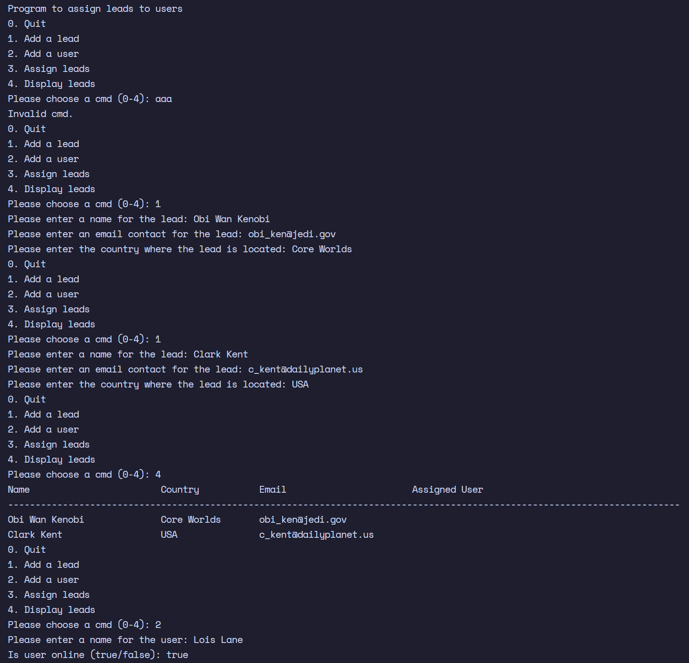
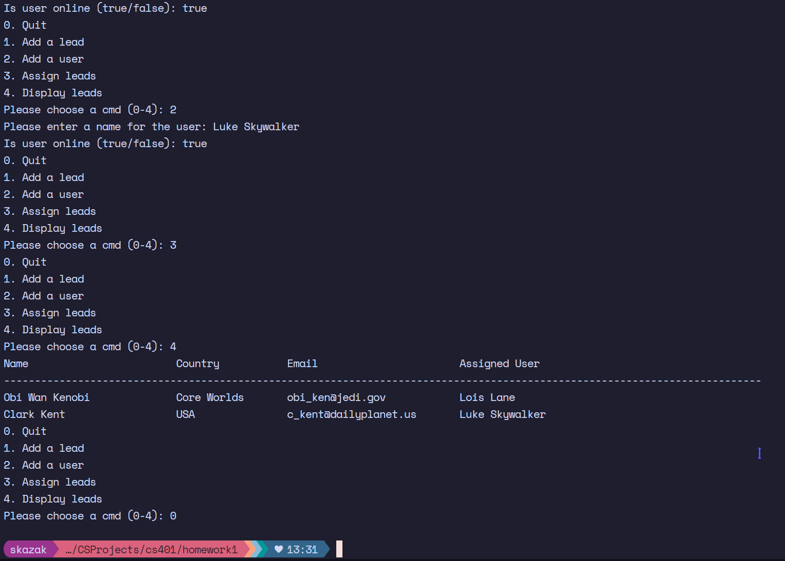

# Homework 1 Assignment

### CS 401 | Sohrab Kazak | 1/20/2023

---
Assignment was to create a very basic system for assignment of leads to users as an introduction to the java programming language. 

CLI App

## Completed introductory assignment objectives
|Status|Deliverable|
|-|-|
| ✅ | Leads class|
| ✅ | Users class|
| ✅ | AssignLeads class |
| ✅ | Systematized assignment to a lead |
| ✅ | Pretty printing |
| ✅ | Menu |

### Example Output

#### TODO/Possible Improvements
-  logon and log off leads
-  log off users
-  online/offline switch for both classes
-  persist data

#### Notes
> Homework1.java is a driver class